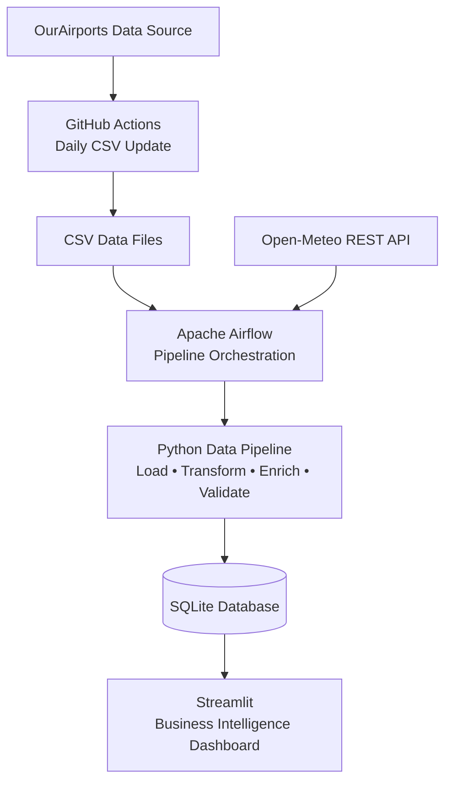

# Airport Business Intelligence Platform

## 1. Project Overview

Airports Analysis is an end-to-end Data Engineering project designed to demonstrate how data can be collected, transformed, validated, orchestrated and visualized using modern data engineering tools.

The project combines airport infrastructure data from the OurAirports open dataset with real-time weather information obtained from the Open-Meteo REST API.

The entire pipeline is orchestrated with Apache Airflow, stored in SQLite, containerized with Docker, automatically tested with pytest, and presented through an interactive Streamlit dashboard.

The project has been developed as a portfolio project to demonstrate practical Data Engineering skills following software engineering best practices.

## 2. Business Goal

The goal of this project is to provide a Business Intelligence platform for airport infrastructure analysis by integrating multiple data sources into a single analytical environment.

The platform allows users to:

- Explore airport infrastructure.
- Analyze runway characteristics.
- Investigate airport communication frequencies.
- Monitor current weather conditions.
- Combine infrastructure and weather information into a unified operational view.

Although the project uses aviation data, its primary objective is to demonstrate modern Data Engineering practices, including data ingestion, transformation, validation, orchestration, testing, and visualization.

## 3. Architecture

The project is built around a modular Data Engineering architecture where data is collected from multiple sources, transformed through Python pipelines, orchestrated with Apache Airflow, stored in SQLite, and finally visualized with Streamlit.


GitHub Actions automatically refreshes the OurAirports CSV datasets on a daily schedule.

Apache Airflow is responsible for orchestrating the data pipeline, including table creation, weather enrichment through the Open-Meteo API, validation, retries, and scheduling.

The processed and validated data is stored in SQLite and consumed by the Streamlit Business Intelligence dashboard.

## 4. Data Sources

The project integrates multiple data sources to build a unified analytical environment.

### 4.1 OurAirports Dataset

The primary data source is the public OurAirports dataset, which provides worldwide airport information.

The project currently imports the following datasets:

- airports.csv
- runways.csv
- airport-frequencies.csv
- countries.csv
- regions.csv

These datasets provide information about:

- Airport infrastructure
- Runway characteristics
- Radio communication frequencies
- Countries
- Administrative regions

---

### 4.2 Open-Meteo REST API

Real-time weather information is retrieved through the Open-Meteo REST API.

The current implementation collects:

- Temperature
- Apparent temperature
- Precipitation
- Weather code
- Wind speed
- Wind direction
- Wind gusts

Weather information is retrieved using the airport latitude and longitude stored in the database.

The API data is integrated into the analytical pipeline and stored in the `airport_weather` table.

## 5. Data Pipeline

The project follows a classic ETL (Extract, Transform, Load) architecture.

### Extract

Data is collected from multiple sources:

- OurAirports CSV files
- Open-Meteo REST API

### Transform

During the transformation phase, the pipeline:

- Cleans and standardizes datasets
- Selects required columns
- Handles missing values
- Validates data quality
- Enriches airport information with weather data
- Calculates weather monitoring priority

### Load

Processed data is stored in a SQLite database.

The current database contains the following tables:

- airports
- runways
- frequencies
- countries
- regions
- airport_weather

### Validation

Before the pipeline finishes, several validation rules are executed:

- Required tables validation
- Duplicate ID validation
- Required columns validation
- Country code validation
- Weather table validation

The validation results are automatically written into the project log files.

## 6. Apache Airflow Orchestration

The entire ETL pipeline is orchestrated using Apache Airflow.

Each stage of the pipeline has been designed as an independent and retryable task, making the workflow modular, maintainable, and fault tolerant.

The current DAG executes the following tasks:

1. Build airports table
2. Build runways table
3. Build frequencies table
4. Build countries table
5. Build regions table
6. Build airport weather table
7. Validate the complete database

Each task can be monitored independently through the Airflow Web UI.

Automatic retry policies have been configured to improve pipeline reliability in case of temporary failures.

## 7. Docker & Containerization

The project is fully containerized using Docker and Docker Compose to ensure a consistent and reproducible execution environment.

Two main services are provided:

- **Pipeline Service**
  - Executes the ETL pipeline.
  - Builds and validates the SQLite database.
  - Retrieves weather information from the Open-Meteo API.

- **Streamlit Service**
  - Provides the interactive Business Intelligence dashboard.
  - Reads data directly from the SQLite database.

The project also includes an Apache Airflow environment orchestrated with Docker Compose, allowing the ETL pipeline to be executed, monitored, and scheduled through the Airflow Web UI.

## 8. Testing

The project includes automated tests developed with pytest to verify the correctness of the most important data transformation functions.

The testing strategy focuses on:

- Data transformation functions
- Data validation logic
- Pipeline reliability
- Regression prevention

Tests can be executed locally using:

```bash
pytest
```

All tests are also executed during development to ensure that new features do not introduce regressions into the existing pipeline.

## 9. Streamlit Dashboard

The final layer of the project is an interactive Streamlit dashboard designed to explore airport infrastructure and operational information.

The dashboard currently includes the following analytical sections:

- Overview
- Airport Types
- Top Countries
- Type Statistics
- Transform Analysis
- Runway Analysis
- Frequency Analysis
- Airport Search
- Business Classification
- Countries & Regions
- Data Quality
- Business Insights
- Airport Map
- Weather Operations Monitoring

The dashboard reads data directly from the SQLite database generated by the ETL pipeline, ensuring that all visualizations are based on validated and up-to-date information.

## 10. Project Structure

```
Airports Analysis
│
├── airflow/                 # Apache Airflow configuration and DAGs
├── data/                    # Source CSV datasets
├── database/                # SQLite database
├── logs/                    # Pipeline logs
├── pages/                   # Streamlit pages
├── scripts/                 # ETL pipeline modules
├── sections/                # Reusable Streamlit components
├── tests/                   # pytest test suite
│
├── app.py                   # Streamlit entry point
├── data_loader.py           # Database access layer
├── filters.py               # Dashboard filters
├── utils.py                 # Utility functions
├── docker-compose.yml
├── requirements.txt
└── README.md
```

The project follows a modular architecture where each component has a single responsibility:

- **scripts/** contains the ETL pipeline, validation logic, database access, API integration, and transformation modules.
- **pages/** contains the Streamlit dashboard pages.
- **sections/** contains reusable dashboard components.
- **tests/** contains the automated test suite.
- **airflow/** contains the orchestration environment and DAG definitions.

## 11. Technology Stack

| Category | Technologies |
|----------|--------------|
| Programming Language | Python 3.8 |
| Data Processing | Pandas |
| Database | SQLite |
| Workflow Orchestration | Apache Airflow |
| Dashboard | Streamlit |
| Containerization | Docker, Docker Compose |
| Testing | pytest |
| API Integration | Open-Meteo REST API |
| Version Control | Git, GitHub |

## 12. Installation & Usage

### Clone the repository

```bash
git clone https://github.com/<your-github-username>/airport-business-intelligence-platform.git

cd airport-business-intelligence-platform
```

### Create a virtual environment

```bash
python -m venv .venv
```

### Activate the virtual environment

Windows

```bash
.venv\Scripts\activate
```

Linux / macOS

```bash
source .venv/bin/activate
```

### Install dependencies

```bash
pip install -r requirements.txt
```

### Build the database

```bash
python -m scripts.build_database
```

### Run the Streamlit dashboard

```bash
streamlit run app.py
```

### Run the test suite

```bash
pytest
```

### Run Apache Airflow

```bash
docker compose \
  --env-file airflow/.env \
  -f airflow/docker-compose.yaml \
  up -d
```

Then open:

```
http://localhost:8080
```

Default credentials:

```
Username: airflow
Password: airflow
```

## 13. Future Roadmap

The current release (v2.0) focuses on building a complete and reliable end-to-end Data Engineering pipeline.

Future versions of the project will extend both the architecture and the supported data sources.

### Version 3

Planned improvements include:

- PostgreSQL support
- dbt transformations
- Additional REST API integrations
- Excel and Parquet data ingestion
- Cloud object storage integration
- Kafka streaming pipeline
- Historical weather analysis
- Advanced Business Intelligence dashboards
- Interactive geographical visualizations
- CI/CD automation with GitHub Actions

The objective is to progressively transform the project into a production-like Data Engineering platform capable of integrating batch, API, and streaming data sources.

## 14. Project Highlights

- End-to-end Data Engineering pipeline.
- Multi-source data integration (CSV + REST API).
- Automated ETL workflow orchestrated with Apache Airflow.
- Data quality validation and automated testing with pytest.
- Modular and maintainable Python architecture.
- Dockerized execution environment.
- Interactive Business Intelligence dashboard built with Streamlit.
- Weather data enrichment using the Open-Meteo REST API.
- SQLite analytical database.
- Designed following software engineering best practices.